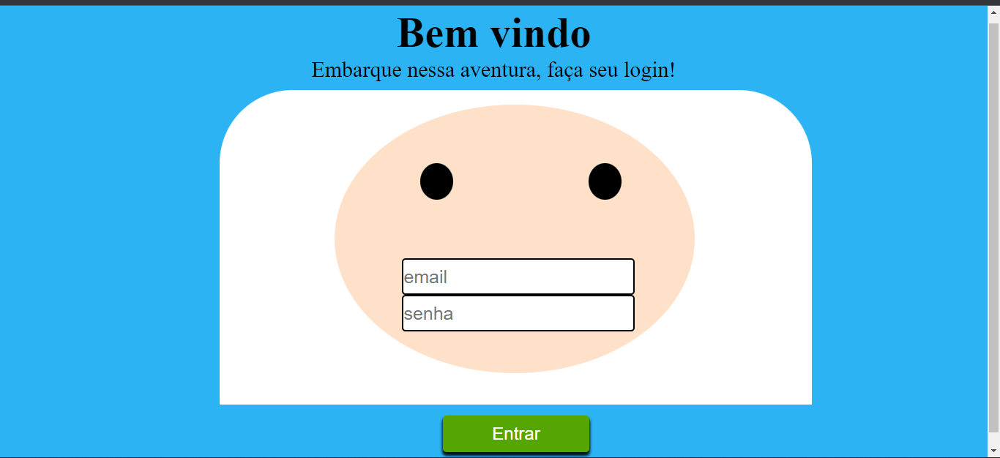

# Desafio-Finn
<h1>Desafio 10 da Escola de programação Vai na web.</h1>

O desafio consiste em criar uma página de login no formato do personagem finn do desenho Hora da Aventura

- O Desafio foi desenvolvido utilizando a propriedade position

 
 

<h2>Tecnologias utilizadas</h2>

<table>
  <thead>
    <tr>
      <th>HTML5</th>
      <th>CSS3</th>
    </tr>
  </thead>
   <tbody>
    <tr>
      <td>
      
 &nbsp;
      </td>
      <td>
          &nbsp;
      </td>

 
